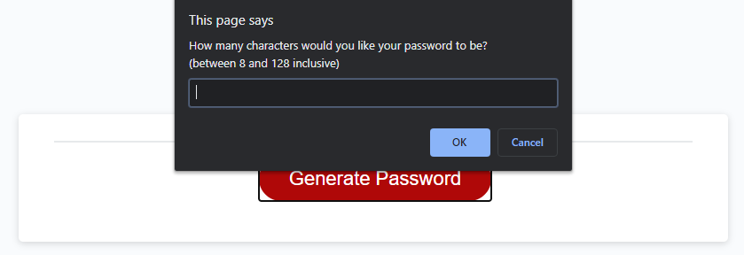
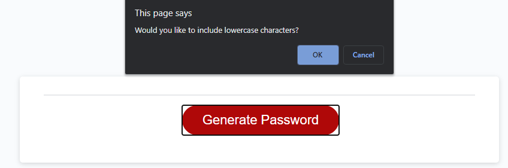
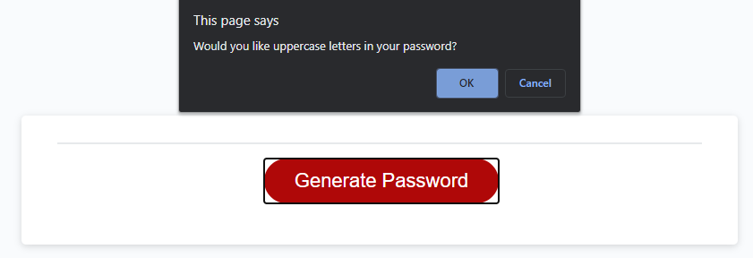
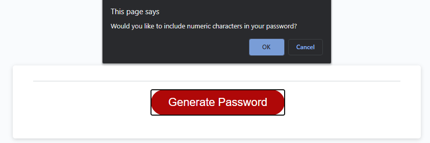
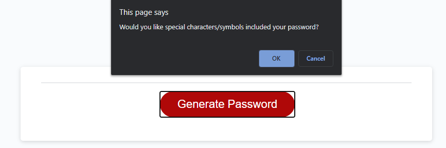
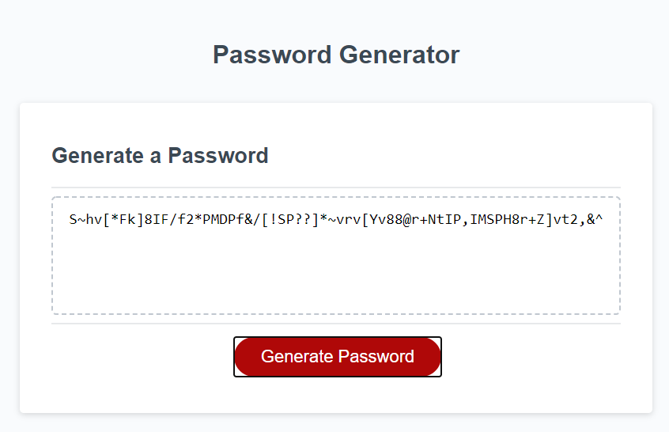

# Password Generator
This is the readme file for the password generator for homework 3.
Comments are made in script.js.
Instead of an array of acceptable values, I used a function to randomly generate a value for a given option.
This is page is ran on alerts, prompts and confirms after you click the button to generate a password.
Note that some of the images below have a diiferent looking HTML. This is due to modifying the HTML to display the javascript differently at the time. Since then, the HTML has been modified to it's current form; the alerts (what the images show) are still the same and it now displays the generated password in a text box rather than the alert. The alert is still in the javascript, but just commented out.

